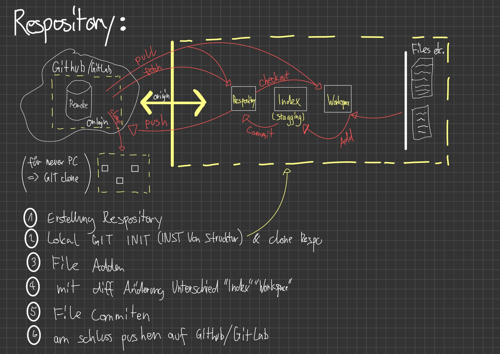

## M300-Services

# Git CheatSheet
Die wichtigsten Git Commands als Übersicht und Erklärung

---

## Git Commands

### Respos erstellen

`git init` : Neues, lokales Repo erstellen

`git clone ssh://user@domain.com/repo.git` : Clonen eines bestehenden Repos

### Lokale Änderungen

`git status` : Veränderte Files in der Working Copy.

`git diff` : Änderungen an versionierten Files.

`git add [File]` : File zum nächsten Commit hinzufügen.

`git add .` : Alle lokalen Änderungen zum nächsten Commit hinzufügen.

`git commit -m "Comment"` : Zur Staging Area hinzugefügte Änderungen committen

`git push` : Lokale Änderungen auf Remote pushen.

`git pull` : Alle Änderungen von <remote> runterladen, aber nicht in HEAD integrieren

`git fetch` : Alle Änderungen von <remote> runterladen, aber nicht in HEAD integrieren

## Mindmap

  

